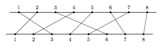

在两条相互平行的直线上分别有按顺序排列的 $n$ 个点，标有 $1, 2, · · · , n$，如下 图所示，上面直线上的每一点 $i$ 分别与下面直线上唯一一点 $\pi(i)$ 相连，反之亦然，也就是说需要 $n$ 条线段 $(i, π(i))$ 来连接这 $n$ 对点。


其中，对于任意两条线段 $(i,π(i))$ 和 $(j,π(j))$ ，若 $i < j$ 且 $π(i) > π(j)$，或者 $i > j$ 且 $π(i) < π(j)$，则这两条线段必然相交。不满足上述条件，即不相交的线段称为相容线段。 试设计算法找到这 $n$ 条线段中的最大相容线段集合， 即该集合中线段互不相交且线段条数最多。例如上图中 ${(1, 3), (3, 6), (6, 7), (8, 8)}$ 即为一个 相容线段集合 (但不一定是最大相容线段集合)。